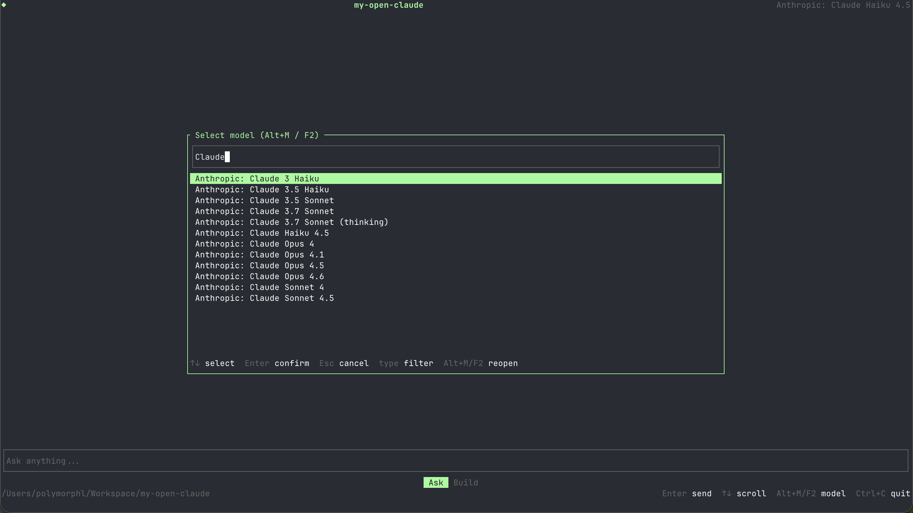

# My Open Claude



LLM-powered coding assistant written in Rust. It understands code and performs actions through tool calls, with a CLI and an interactive TUI chat mode.

## Features

- **TUI interface**: interactive chat in the terminal (ratatui + crossterm)
- **Single-prompt mode**: send one request and exit without opening the TUI
- **Tool calling**: OpenAI-compatible API (read, write, bash, etc.)
- **OpenRouter**: use models via the OpenRouter API (or other OpenAI-compatible backends)
- **Model selector**: choose from tool-capable models (Alt+M / F2), with persisted selection
- **Credit balance**: OpenRouter balance displayed in the header; click to open your account settings

## Prerequisites

- [Rust](https://www.rust-lang.org/) (rustc 1.93+)
- An OpenRouter API key (or other OpenAI-compatible provider)

## Installation

```sh
git clone https://github.com/polymorphl/my-open-claude.git
cd my-open-claude
cargo build --release
```

## Configuration

The app relies on environment variables. Use a `.env` file in the project root:

1. Copy the example file:
   ```sh
   cp env.example .env
   ```
2. Edit `.env` and set the values (e.g. `OPENROUTER_API_KEY`). See comments in `env.example` for details.

### Environment variables

| Variable | Required | Description |
|----------|----------|-------------|
| `OPENROUTER_API_KEY` | Yes | Your OpenRouter API key |
| `OPENROUTER_MODEL` | No | Default model ID (used when no last model saved). Default: `anthropic/claude-haiku-4.5` |
| `OPENROUTER_BASE_URL` | No | API base URL. Default: `https://openrouter.ai/api/v1` |

### Configuration paths

| Usage | Linux | macOS | Windows |
|-------|-------|-------|---------|
| Config (last selected model) | `~/.config/io/polymorphl/my-open-claude/` | `~/Library/Application Support/io.polymorphl.my-open-claude/` | `%APPDATA%\io\polymorphl\my-open-claude\` |
| Cache (models list, 24h TTL) | `~/.cache/io/polymorphl/my-open-claude/models.json` | `~/Library/Caches/io.polymorphl.my-open-claude/models.json` | `%LOCALAPPDATA%\io\polymorphl\my-open-claude\Cache\models.json` |

## Usage

**TUI mode (default)** — open the interactive chat:

```sh
cargo run
# or, after building:
./target/release/my-open-claude
```

**Single-prompt mode** — one request then exit:

```sh
cargo run -- -p "Explain what this project does"
```

### Credit balance

The header shows your OpenRouter credit balance (total minus usage). Click it to open your credits page. Balance is fetched on startup and refreshed every 30 minutes. Requires a Management API key; regular keys may see "—" instead.

### Model selection

- Press **Alt+M** (or **F2**, or **Option+M** on macOS) to open the model selector.
- Only models that support tool calling are listed (sorted alphabetically).
- Type to filter by model name or ID.
- The last selected model is saved and reused on next launch.

## Project structure

- `src/main.rs` — entry point, CLI parsing, TUI or prompt mode launch
- `src/core/` — business logic: config, credits, confirm, persistence, LLM (agent loop, tools), models (fetch, cache)
- `src/core/llm/` — chat, agent loop, tool execution, streaming
- `src/core/models/` — model discovery, 24h cache, filtering
- `src/core/tools/` — read, write, bash
- `src/tui/` — terminal UI: app state, handlers (key/mouse), draw (header, history, input, popups)
