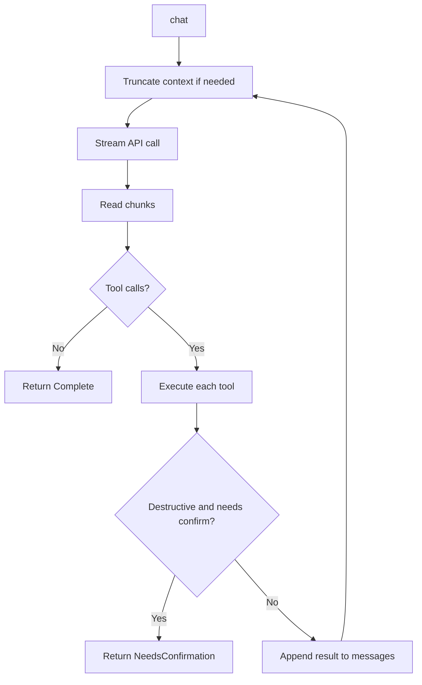
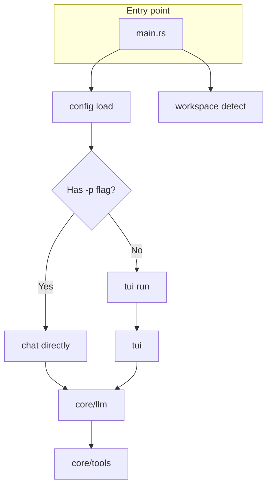

# Architecture & Flows

## Agent loop

The core chat flow: the model is called, streams a response, and may request tool execution. The loop repeats until the model responds without tool calls, or returns `NeedsConfirmation` for a destructive command (e.g. `rm`, `rmdir`).

## Entry point & modes

The application supports two modes: single-prompt (one request then exit) and TUI (interactive chat). Both use the same `core` modules.

