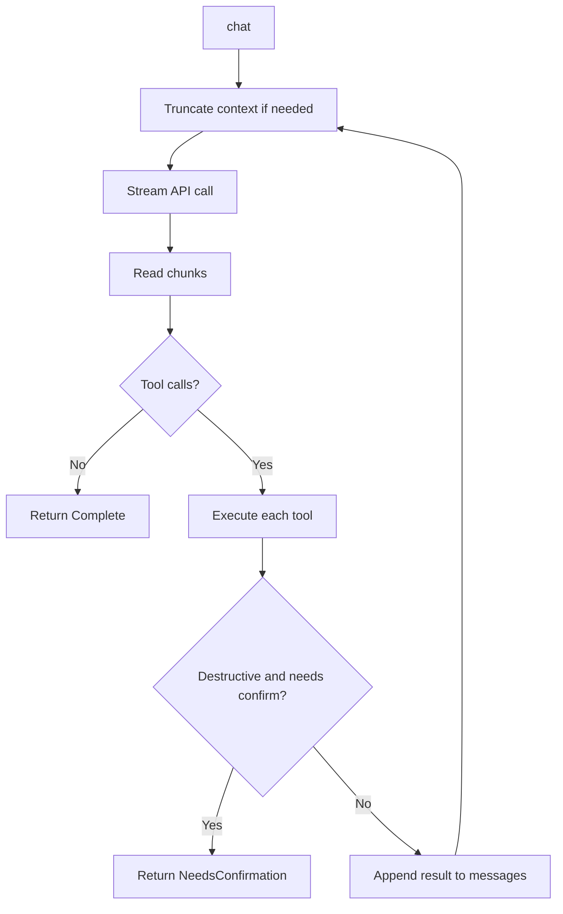
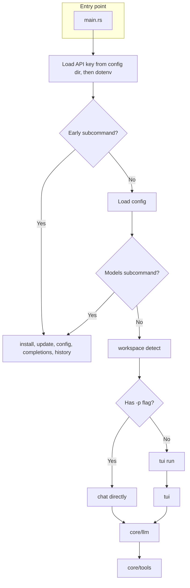

# Architecture & Flows

## Agent loop

The core chat flow: the model is called, streams a response, and may request tool execution. The loop repeats until the model responds without tool calls, or returns `NeedsConfirmation` for a destructive command (e.g. `rm`, `rmdir`).

## Entry point & modes

The application supports two modes: single-prompt (one request then exit) and TUI (interactive chat). Both use the same `core` modules.

### API key resolution order

1. Environment variable `OPENROUTER_API_KEY` (if non-empty)
2. Stored key in config directory (`core::api_key::load_api_key`)
3. `.env` in current directory (`dotenv`)

## Subcommands

Subcommands that exit before the TUI:

| Subcommand | Module | Description |
|------------|--------|-------------|
| `install` | `core/install` | Copy binary to `~/.cargo/bin` |
| `update` | `core/update` | Self-update from GitHub releases |
| `config show` | `core/cli` | Show config paths, model, API key status |
| `config set-api-key` | `core/cli` | Store API key in config dir |
| `models` | `core/cli` | List tool-capable models (with optional `--query`) |
| `history list` | `core/cli` | List conversations |
| `completions` | `cli.rs` | Generate shell completion script |

## Workspace detection

Before launching chat (single-prompt or TUI), the app detects the workspace:

- **Root**: project root directory (e.g. Git root)
- **Project type**: inferred from presence of `Cargo.toml`, `package.json`, etc.
- **AGENTS.md**: loaded from workspace root and injected into the system prompt when present

Used by the LLM to tailor responses and tool usage to the project context.

## Ask vs Build mode

| Mode | Tools available | Use case |
|------|-----------------|----------|
| **Ask** | Read, Grep, ListDir, Glob only | Read-only; explanations, analysis, no file writes or shell |
| **Build** | Full tools (Read, Write, Edit, Bash, etc.) | Code changes, file writes, command execution |

Set by slash commands or via `-p --ask` in single-prompt mode.

## Copy to clipboard

Copy logic lives in `tui/handlers/selection.rs` and `tui/app` (`CopyTarget`).

- **Copy regions**: each message and code block registers a (start_line, end_line, target) for hit-testing.
- **Click-to-copy**: mouse click hits a region → copy `CopyTarget::Message(idx)` or `CopyTarget::Code(code)` via `arboard`.
- **Keyboard copy**: ⌘C / Ctrl+Shift+C copies the message under focus or the current text selection.
- **Toast**: brief "Copied" confirmation when copy succeeds.
